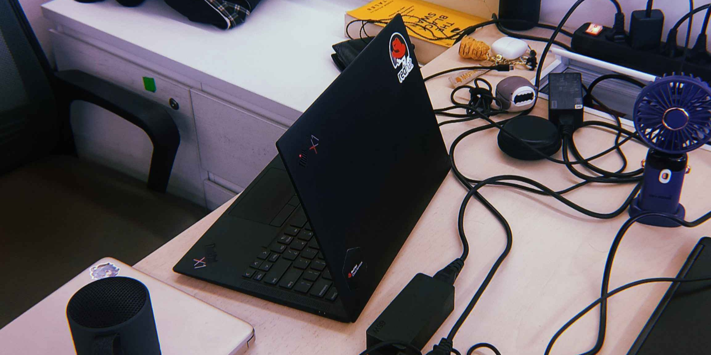

<picture>
    <source media="(prefers-color-scheme: dark)" srcset="https://raw.githubusercontent.com/luxamrown/luxamrown/716778e25be1e7ef88a30cc176d2a1a93e5b08b2/header.svg">
    <source media="(prefers-color-scheme: light)" srcset="https://raw.githubusercontent.com/luxamrown/luxamrown/716778e25be1e7ef88a30cc176d2a1a93e5b08b2/header.svg" />
    
</picture>
 

    <picture>
        
    </picture>

<picture>
    <source media="(prefers-color-scheme: dark)" srcset="https://raw.githubusercontent.com/luxamrown/luxamrown/20de96cd7ba85938a2b41c2c369bec7989bc4632/bottom.svg">
    <source media="(prefers-color-scheme: light)" srcset="https://raw.githubusercontent.com/luxamrown/luxamrown/20de96cd7ba85938a2b41c2c369bec7989bc4632/bottom.svg" />
    
</picture>
